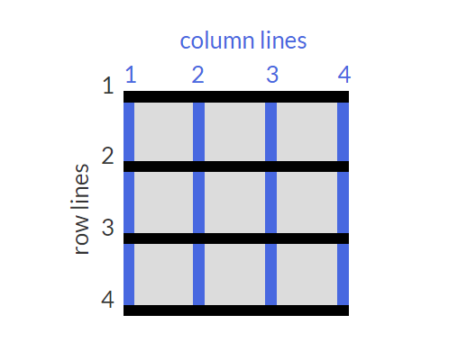

# 参考自freeCodeCamp中文社区 响应式设计Web（300小时）闯关课程，以下为闯关时的笔记👇：

# HTML基础 （再学习）
## 查缺补漏：
1. 单选框与复选框

每个选项包含在lable里面
```html
<!-- 包含在label里面 --><label for="indoor"><input id="indoor" type="radio" name="indoor-outdoor">室内</label>
<label for="loving"><input id="loving" type="checkbox" name="personality"> Loving</label>
```

2. input的number类型

可确定最大值和最小值


# CSS基础
## 查缺补漏：
## 1. 字体的引入
```html
<link href="https://fonts.googleapis.com/css?family=Lobster" rel="stylesheet" type="text/css">
```
## 2. 图片大小的调整
```css
.smaller-image{
    width: 100px;
}
```
## 3. 绝对单位与相对单位

绝对单位： in\mm\ ..

相对单位： em\rem\ ..（根据父元素的font-size值来改变）

## 4. 选择器及其权重

>从0开始，一个行内样式+1000，一个id+100，一个属性选择器/class或者伪类+10，一个元素名，或者伪元素+1  
基本规则：  
相同权重：以后面出现的选择器为最后规则   
不同权重：权重值高则生效  
著作权归作者所有。商业转载请联系作者获得授权,非商业转载请注明出处。
原文: https://www.w3cplus.com/css/css-specificity-things-you-should-know.html © w3cplus.com

## 5. CSS变量
使用CSS变量仅仅更改一个值来一次性更改多个CSS样式属性  
定义的变量所在的选择器，只能用于与其相关的地方，CSS变量应理解为其中一种CSS属性，其也满足权重，继承等相关概念  
若想全局使用可以设置再`:root选择器`上  
```css
:root{
    --蓝色:blue;
}
p{
    background: var(--蓝色, black);
    /* 可以像设置降级字体一样，给CSS变量附加回退值以防止浏览器不兼容或者拼写错误带来的变量失效*/
}

```

# 应用视觉设计
## 1.使用text-align属性创建视觉平衡
```css
text-align: justify;
/* 可以让除最后一行之外的文字两端对齐，即每行的左右两端都紧贴行的边缘。 */

text-align: center;
/* 可以让文本居中对齐。 */

text-align: right;
/* 可以让文本右对齐。 */

text-align: left;
/* 是text-align的默认值，它可以让文本左对齐。 */
```
## 2.一些标签对应的CSS效果
```html
<strong>加粗，font-weight:bold;</strong>
<u>下划线，text-decoration:underline;</u>
<em>强调，font-style:italic;</em>
<s>删除线，text-decoration:line-through;</s>
```
## 3.text-transform设置文本大小写
```css
text-transform: lowercase;
/* 小写 */
text-transform: uppercase;
/* 大写 */
text-transform: capitalize;
/* 首字母大写 */
```
## 4.了解互补色

```css
红色(#ff0000)和蓝绿色(#00fffff)
绿色(#00ff00)和品红色(#ff00ff)
蓝色(#0000ff)和黄色(#ffff00)
```

采用分裂补色搭配法创建的三个颜色
| 颜色 | HEX颜色码 |
| :--: | :--: |
| 橙色 | #FF7D00 |
| 蓝绿色 | #00FFFF |
| 树莓红 | #FF007D |

## 5.调整颜色的色相

>HSL 色彩空间模型是一种将 RGB 色彩模型中的点放在圆柱坐标系中的表示法，描述了色相（hue）、饱和度（saturation）、亮度（lightness）。CSS3 引入了对应的hsl()属性做为对应的颜色描述方式。

>色相是色彩的基本属性，就是平常所说的颜色名称，如红色、黄色等。以颜色光谱为例，光谱左边从红色开始，移动到中间的绿色，一直到右边的蓝色，色相值就是沿着这条线的取值。在hsl()里面，色相用色环来代替光谱，色相值就是色环里面的颜色对应的从 0 到 360 度的角度值。

>饱和度是指色彩的纯度，也就是颜色里灰色的占比，越高色彩越纯，低则逐渐变灰，取0-100%的数值。

>亮度决定颜色的明暗程度，也就是颜色里白色或者黑色的占比，100% 亮度是白色， 0% 亮度是黑色，而 50% 亮度是“一般的”。

>下面是一些使用hsl()描述颜色的例子，颜色都为满饱和度，中等亮度:  

| 颜色 | HSL |
| :--: | :--: |
|红	|hsl(0, 100%, 50%)|
|黄	|hsl(60, 100%, 50%)|
|绿	|hsl(120, 100%, 50%)|
|蓝绿|	hsl(180, 100%, 50%)|
|蓝	|hsl(240, 100%, 50%)|
|品红|	hsl(300, 100%, 50%)|

## 6. 线性渐变
```css
linear-gradient(方向, 颜色, ...);

repeating-linear-gradient(方向, 颜色 位置, 颜色 位置, 颜色 位置, ...);
/* 重复指定的渐变 */
background: repeating-linear-gradient(
      45deg, 
      yellow 0px,
      yellow 40px,
      black 40px,
      black 80px
    );
/* 利用重复线性渐变创建条纹 */
```

## 7. transform
```css
transform: scale(倍数);
/* 放大或缩小到设置的倍数 */
transform: skewX(度数deg);
/* 使选择的元素沿X轴方向（横向）翻转指定的角度 */
transform: skewY(度数deg);
/* 使选择的元素沿y轴方向（纵向）翻转指定的角度 */
```

## 8.使用CSS创建一个图形
> 术语表：blur-radius => 模糊半径，spread-radius => 辐射半径，transparent => 透明的，border-radius => 圆角边框。

```css
.center
{
  position: absolute;
  margin: auto;
  top: 0;
  right: 0;
  bottom: 0;
  left: 0;
  width: 100px;
  height: 100px;  
  background-color: transparent;
  border-radius: 50%;
  box-shadow: 25px 10px 0 0 blue; 
}
/* 新月 */
```
更复杂的图形（如心形💗）
```css
<style>
.heart {
  position: absolute;
  margin: auto;
  top: 0;
  right: 0;
  bottom: 0;
  left: 0;
  background-color: pink;
  height: 50px;
  width: 50px;
  transform: rotate(-45deg);
}
.heart:after {
  background-color: pink;
  content: "";
  border-radius: 50%;
  position: absolute;
  width: 50px;
  height: 50px;
  top: 0px;
  left: 25px;
}
.heart:before {
  content: "";
  background-color: pink;
  border-radius: 50%;
  position: absolute;
  width: 50px;
  height: 50px;
  top: -25px;
  left: 0px;
}
</style>
<div class = "heart"></div>
```

## 9.了解CSS关键帧和动画

>@keyframes(可见其译名为`关键帧`)能够创建动画。 创建动画的原理是将一套 CSS 样式逐渐变化为另一套样式。具体是通过设置动画期间对应的“frames”的 CSS 的属性，以百分比来规定改变的时间，或者通过关键词“from”和“to”，等价于 0% 和 100%。打个比方，CSS 里面的 0% 属性就像是电影里面的开场镜头。CSS 里面的 100% 属性就是元素最后的样子，相当于电影里的演职员表或者鸣谢镜头。CSS 在对应的时间内给元素过渡添加效果。
```css
#anim {
  animation-name: colorful;
  animation-duration: 3s;
  animation-fill-mode: forwards;
  /* 修改动画的填充模式：forwards保持100%，backwards保持0% */
  animation-iteration-count:infinite;
  /* 动画计数：无限次 */
  animation-timing-function:linear:
  /* 使用关键字更改动画定时器：ease：低速开始，然后加快，结束前变慢
  ease-out：高速开始，低速结束
  linear：从头到尾速度相同 */
}
@keyframes colorful {
    /* 实际上是设置不同时刻的CSS样式 */
  0% {
    background-color: blue;
  }
  100% {
    background-color: yellow;
  }
}
```

## 10.学习贝塞尔曲线的原理
>在 CSS 动画里，用cubic-bezier来定义贝塞尔曲线。曲线的形状代表了动画的速度。曲线在 1*1 的坐标系统内，曲线的 X 轴代表动画的时间间隔（类似于时间比例尺），Y 轴代表动画的改变。

>cubic-bezier函数包含了 1 * 1 网格里的4个点：p0、p1、p2和p3。其中p0和p3是固定值，代表曲线的起始点和结束点，坐标值依次为 (0, 0) 和 (1, 1)。你只需设置另外两点的 x 值和 y 值，设置的这两点确定了曲线的形状从而确定了动画的速度曲线。在 CSS 里面通过(x1, y1, x2, y2)来确定p1和p2。综上，下面就是 CSS 贝塞尔曲线的例子：

```css
animation-timing-function: cubic-bezier(0, 0, 0.58, 1);
```
[贝塞尔曲线在线取值](https://cubic-bezier.com/#0,0,1,1)

# 应用无障碍

## h5的语义化标签
```html
<header>页面顶部信息</header>
<nav>导航栏：主导航链接</nav>
<main></main>
<article>分段标签，用于独立的、完整的内容</article>
<section>用于对与主题相关的内容进行分组</section>
<footer>底部：版权信息或者相关文档链接</footer>
<audio>用于呈现音频内容</audio>
<!-- 例子 -->
<audio id="meowClip" controls> 
<!-- controls属性是一个布尔属性，添加这个属性即可开启播放控件。 -->
  <source src="audio/meow.mp3" type="audio/mpeg" />
  <source src="audio/meow.ogg" type="audio/ogg" />
</audio>


<figure>figure标签以及与之相关的figcaption标签。它们一起用于展示可视化信息（如：图片、图表）及其标题。这样通过语义化对内容进行分组并配以用于解释figure的文字，可以极大的提升内容的可访问性。</figure>
<!-- 例子 -->
<figure>
  
  <br>
  <figcaption>
    Master Camper Cat demonstrates proper form of a roundhouse kick.
  </figcaption>
</figure>


<!-- 将单选按钮包裹在fieldset里面 -->
<form>
  <fieldset>
    <legend>Choose one of these three items:</legend>
    <input id="one" type="radio" name="items" value="one">
    <label for="one">Choice One</label><br>
    <input id="two" type="radio" name="items" value="two">
    <label for="two">Choice Two</label><br>
    <input id="three" type="radio" name="items" value="three">
    <label for="three">Choice Three</label>
  </fieldset>
</form>

<time>time标签与datetime属性来标准化时间。time是一个行内标签，用于在页面中呈现日期或时间，而datetime属性保存了日期的有效格式，辅助设备可以访问这个值。</time>
<time datetime="2019-07-09"></time>

tabindex属性:有三个不同与标签焦点的功能。当它在标签上时，表示标签可以获得焦点。它的值可以是零、负整数及正整数，并决定了标签的行为。
<div tabindex="0">I need keyboard focus!</div>
tabindex属性值为 1 的标签将首先获得键盘焦点，然后焦点将按照指定的tabindex的值（如：2，3 等）的顺序进行移动，直到回到默认的或tabindex值为 0 的标签上，如此循环。

需要注意的是，当按照这种方式设置 tab 键顺序时，将会覆盖默认的顺序（标签在文档流中出现的顺序）。这可能会令那些希望从页面顶部开始导航的用户感到困惑。这个技术在某些情况下可能是必要的，但是对可访问性而言，在应用时要十分小心。
<div tabindex="1">I get keyboard focus, and I get it first!</div>
<div tabindex="2">I get keyboard focus, and I get it second!</div>
```

# 响应式Web设计原则

## 1. 媒体查询
```css
@media (max-width: 100px) {} 
/* 设备屏幕大小小于等于 100px */
@media (min-width: 100px) {} 
/* 设备屏幕大小大于等于 100px */
```

## 2.图片自适应
```css
img {
  max-width:100%; /*让图片以100%的最大宽度适应其父容器的宽度*/
  display:block; /*内联元素变块级元素*/
  height:auto;/*保持图片的原始宽高比*/
}


针对高分辨率屏幕应使用视网膜图片  
最简单的方式是定义它们的 width 和 height 值为源文件宽高的一半。
<style>
  img { height: 250px; width: 250px; }
</style>

```

## 3. 使排版根据设备尺寸自如响应

采用视窗单位设置字体大小
- vw：如 10vw 的意思是视窗宽度的 10%。
- vh： 如 3vh 的意思是视窗高度的 3%。
- vmin： 如 70vmin 的意思是视窗中较小尺寸的 70% (高度 VS 宽度)。
- vmin： 如 70vmin 的意思是视窗中较小尺寸的 70% (高度 VS 宽度)。


# CSS3弹性盒子 Flexible Box

## 1. 设置display:flex
```css
设置display：flex开始响应式布局
添加了display:flex的容器将会变成flex容器
display:flex;
```

## 2.flex-direction
>对flex容器设置flex-direction，这将会使flex容器的子元素的排列发生改变  
flex-direction可选的值为row、column、row-reverse、column-reverse
```css
#box{
  display:flex;
  flex-direction:row;
  /* 横排子元素 */
  flex-direction:column;
  /* 竖排子元素 */
  flex-direction:row-reverse;
  /* 反转横排子元素 */
  flex-direction:column-reverse;
  /* 反转竖排子元素 */
}
```

## 3.使用justify-content属性对齐元素
flex-direction:row;行排列，主轴水平贯穿

flex-direction:column;竖排列，主轴垂直贯穿


justify-content:可选值及其效果

- flex-start：从 flex 容器的前端开始排列项目。对行来说是把项目都靠左放，对于列是把项目都靠顶部放。
- flex-end：从 flex 容器的后端开始排列项目。对行来说是把项目都靠右放，对于列是把项目都靠底部放。
- space-between：项目间保留一定间距地在主轴排列。第一个和最后一个项目会被挤到容器边沿。例如，在行中第一个项目会紧贴着容器左侧，最后一个项目会紧贴着容器右侧，然后其他项目均匀排布。
- space-around：与space-between相似，但头尾两个项目不会紧贴容器边缘，空间会均匀分布在所有项目两边


## 4.使用align-items属性对齐元素
>可选值类似于justify-content，不同的地方在于align-items相对于交叉轴(cross axis)，justify-content相对于(main axis)，看上图👆

- flex-start：从 flex 容器的前端开始排列项目。对行来说是把项目都靠顶部放，对于列是把项目都靠左放。
- flex-end：从 flex 容器的后端开始排列项目。对行来说是把项目都靠底部放，对于列是把项目都靠右放。
- center：把项目的位置调整到中间。对于行，垂直居中（项目上下方空间相等）。对于列，水平居中（项目左右方空间相等）。
- stretch：拉伸项目，填满 flex 容器。例如，排成行的项目从容器顶部拉伸到底部。
- baseline：基线对齐地排列。基线是字体相关的概念，可以认为字体坐落在基线上。

## 5.使用flex-wrap属性包裹一行或一列

>CSS flexbox 有一个把 flex 子元素拆分为多行（或多列）的特性。默认情况下，flex 容器会调整项目大小，把它们都塞到一起。如果是行的话，所有项目都会在一条直线上。  
不过，使用flex-wrap属性可以使项目换行。这意味着多出来的项目会被移到新的行或列。换行发生的断点由项目和容器的大小决定。

换行的方向的可选值有：
- nowrap：默认值，不换行。
- wrap：行从上到下排，列从左到右排。
- wrap-reverse：行从下到上排，列从右到左排。

## 6.使用flex-shrink属性收缩项目

>首先介绍的是flex-shrink属性。使用之后，如果 flex 容器太小，该项目会自动缩小。当容器的宽度小于里面所有项目的宽度，项目就会自动压缩。  

该属性的可选值为：number类型的值。  
数值越大，与其他项目相比会被压缩得更厉害。例如，如果一个项目的flex-shrink为 1 ，另一个项目flex-shrink为 3，那么 3 的那个与另一个相比会受到 3 倍压缩。

## 7.使用flex-grow属性扩展项目

>flex-grow与flex-shrink相对；你应该还记得，flex-shrink会在容器太小时对元素作出调整。相应地，flex-grow会在容器太大时对元素作出调整。

因此该属性可选值也是：number类型的值。
值越大，与其他项目相比会被扩展得更厉害。如果一个项目flex-grow属性的值为 1，另一个flex-grow为 3，那么 3 的会比 1 的扩大三倍。

## 8.使用flex-basis属性设置项目的初始大小

>flex-basis属性指定了项目在 CSS 进行flex-shrink或flex-grow调整前的初始大小。  
flex-basis属性的单位与其他 size 属性一致（px、em、%等）。如果值为auto，项目的大小依赖于自身内容。

## 9.flex短方法属性
flex-grow、flex-shrink、flex-basis简便写法

设置flex:0 1 auto;（这是默认设置）依次是flex-grow、flex-shrink、flex-basis。

## 10.使用order属性重新排列项目

>order属性告诉 CSS flex 容器里项目的顺序。默认情况下，项目排列顺序与源 HTML 文件中顺序相同。这个属性接受数字作为参数，可以使用负数。

## 11.使用align-self属性

>flex 子元素的最后一个属性是align-self。这个属性允许你调整每个项目自己的对齐方式，而不是一次性设置全部项目。因为float、clear和vertical-align等调整使用的属性都不能应用在 flex 子元素，所以这个属性显得十分有用。
align-self的允许值与align-items一样，并且它会覆盖align-items的值。

这里再看看align-self的允许值：(注意其与align-items最大区别在于align-items用于flex父容器，设置后排列其子元素，align-self用于flex容器的子元素)  
- flex-start：从 flex 容器的前端开始排列项目。对行来说是把项目都靠顶部放，对于列是把项目都靠左放。
- flex-end：从 flex 容器的后端开始排列项目。对行来说是把项目都靠底部放，对于列是把项目都靠右放。
- center：把项目的位置调整到中间。对于行，垂直居中（项目上下方空间相等）。对于列，水平居中（项目左右方空间相等）。
- stretch：拉伸项目，填满 flex 容器。例如，排成行的项目从容器顶部拉伸到底部。
- baseline：基线对齐地排列。基线是字体相关的概念，可以认为字体坐落在基线上。


# CSS Grid （CSS网格）

## 1.设置display:grid

>通过将属性display的值设为grid，使 HTML 元素变为网格容器。通过前面的操作，你可以对该容器使用与 CSS 网格（CSS Grid）相关的属性。   
注意：
在 CSS 网格中，父元素称为容器（container），它的子元素称为项（items）。

## 2.使用grid-template-columns添加多列

>简单地添加一个网格元素并不能取得很大的进展。你还需要明确网格的结构。在一个网格容器中使用grid-template-columns属性可以添加一些列，示例如下：
```css
.container {
  display: grid;
  grid-template-columns: 50px 50px;
}
上面的代码可以在网格容器中添加两列，宽度均为 50px。

grid-template-columns属性值的个数表示网格的列数，而每个值表示对应列的宽度。
```

## 3.使用grid-template-rows添加多行
>用grid-template-columns设置网格的列一样，用grid-template-rows为网格设置行数。
```css
.container {
  display: grid;
  grid-template-rows: 50px 50px;
}
上面的代码可以在网格容器中添加两行，宽度均为 50px。

grid-template-rows属性值的个数表示网格的行数，而每个值表示对应列的宽度。
```

## 4.CSS网格单位
>在css网格中，可以使用绝对定位和相对定位单位如px和em来确定行或列的大小，下面是特殊的css网格单位:  

| 单位名称 | 大小 |
| :--: | :--: |
| fr | 所占剩余空间的比例 |
| auto | 自动等于它的内容的宽度或高度 |
| % | 容器的百分比 |

## 5.使用grid-column-gap创建多列之间的间距
`grid-column-gap: 10px;`  
使创建的所有列之间添加10px的空白间隙。

## 6.使用grid-row-gap创建多行之间的间距
`grid-row-gap: 10px;`   
使创建的所有行之间添加10px的空白间隙。

## 7.使用grid-gap更快添加间距
grid-gap只有一个值的时候代表行和列距相等均为同一值    
`grid-gap: 10px 20px; `    
grid-gap有两个值时，第一个值为行间隙，第二个值为列间隙。

## 8.使用grid-column来控制剩余部分
###  这一项开始是用于网格项即items

首先明白一个概念：网格的线(lines)。   
>网格的假想水平线和垂直线被称为线（lines）。这些线在网格的左上角从 1 开始编号，垂直线向右、水平线向下累加计数。  
这是一个3×3网格👇：   


使用grid-column属性定义网格项开始和结束的位置，进而控制每个网格项占用的列数（个人认为相当于table td的columnspan）

## 9.使用grid-row来控制剩余部分
类似于grid-column，用来控制行，参考上方👆

## 10.使用justify-self水平对齐项目
> 在 CSS 网格中，每个网格项的内容分别位于被称为单元格（cell）的框内。你可以使用网格项的justify-self属性，设置其内容的位置在单元格内沿行轴对齐的方式。默认情况下，这个属性的值是stretch，这将使内容占满整个单元格的宽度。该 CSS 网格属性也可以使用其他的值：  
- start：使内容在单元格左侧对齐
- center：使内容在单元格居中对齐
- end：使内容在单元格右侧对齐   
注意：这是相对于单元格！！

## 11.使用align-self垂直对齐项目

> 正如能设置网格项沿行轴对齐方式一样，也可以设置网格项沿列轴对齐方式：你可以对网格项使用align-self属性。对于该属性，你能使用在上一个挑战中可用于justify-self属性的任一个值。

## 12.使用justify-items水平对齐所有项目

>有时你想让在 CSS 网格中的网格项共享对齐方式。你可以像之前学习的那样单独使他们对齐，也可以对网格容器使用justify-items使它们一次性沿行轴对齐。对于这个属性你能使用在之前的两个挑战中学到的所有值，与之前不同的是，它将使网格中所有的网格项按所设置的方式对齐。

## 13.使用align-items垂直对齐所有项目

>对网格容器使用align-items属性可以给网格中所有的网格项设置沿列轴对齐的方式。

## 14.将网格划分为区域模板

>你可以将网格中的一些网格单元格组合成一个区域（area），并为该区域指定一个自定义名称。你可以通过给容器加上grid-template-areas来实现：
```css
grid-template-areas:
  "header header header"
  "advert content content"
  "footer footer footer";
```

>注意：
在代码中，每个单词代表一个网格单元格，每对引号代表一行。   
除了自定义标签，你还能使用句点（.）来表示一个空单元格

## 15.使用grid-area属性将项目放置在网格区域中
> 通过添加你定义的名称将网格项放入自定义区域。  
`.item1{grid-area:header;}`   

>或者使用lines放置在目标网格区域中   
`grid-area: 起始水平线 / 起始垂直线 / 末尾水平线 / 终止垂直线 ;`

## 16.使用repeat函数减少重复

> 当使用grid-template-columns和grid-template-rows定义网格结构时，你需要为添加的每一行和每一列都输入一个值。    
如果要添加带 100 行高度相同的网格，单独放入 100 个值不太实际。幸运的是，有一种更好的方法——使用repeat方法指定行或列的重复次数，后面加上逗号以及需要重复的值。

```css
grid-tempalte-rows: repeat(100, 50px);
/* 创建100行，每行50px */
grid-template-columns:repeat(2, 1fr 50px) 20px;
/* 相当于*/
grid-template-columns: 1fr 50px 1fr 50px 20px;
```

## 17.使用minmax函数限制项目大小

>此外，内置函数minmax也可以可用于设置grid-template-columns和grid-template-rows的值。它的作用是在网格容器改变大小时限制网格项的大小。为此，你需要指定网格项允许的尺寸范围。例如：

```css
grid-template-columns: 100px minmax(50px, 200px);
/* 在上面的代码中，grid-template-columns被设置为添加两列，第一列 100px 宽，第二列宽度最小值是 50px，最大值是 200px。 */
```

## 18. 使用auto-fill创建弹性布局

> 重复方法`repeat()`带有一个名为自动填充（auto-fill）的功能。它的功能是根据容器的大小，尽可能多地放入指定大小的行或列。你可以通过结合auto-fill和minmax来更灵活地布局。  
```css
repeat(auto-fill, minmax(60px, 1fr))
/* 尽可能多的设置最小宽度为60px，最大为1fr的列 */
```
>注意：
如果容器无法使所有网格项放在同一行，余下的网格项将移至新的一行。

## 19.auto-fit创建弹性布局

>auto-fit效果几乎和auto-fill一样。不同点仅在于，当容器的大小大于各网格项之和时，auto-fill将会持续地在一端放入空行或空列，这样就会使所有网格项挤到另一边；而auto-fit则不会在一端放入空行或空列，而是会将所有网格项拉伸至合适的大小。   

>注意：
如果容器无法使所有网格项放在同一行，余下的网格项将移至新的一行。

## 20.结合媒体查询和网格模板实现响应式
```css
.container{
  grid-template-area:
  "advert header"
  "advert content"
  "advert footer";
  /* 创建区域模板  2×3*/
}
.item1{
  grid-area: advert;
  /* 绑定目标区域 */
}
.item2{
  grid-area: 2/2/3/3;
  /* lines方式绑定content*/
}
.item3{
  grid-area: footer;
}
@media (min-width) {
  .container{
    grid-template-area:
    "header header"
    "advert content"
    "footer footer";
  }
}

```

## 21.grid网格可以进行嵌套

